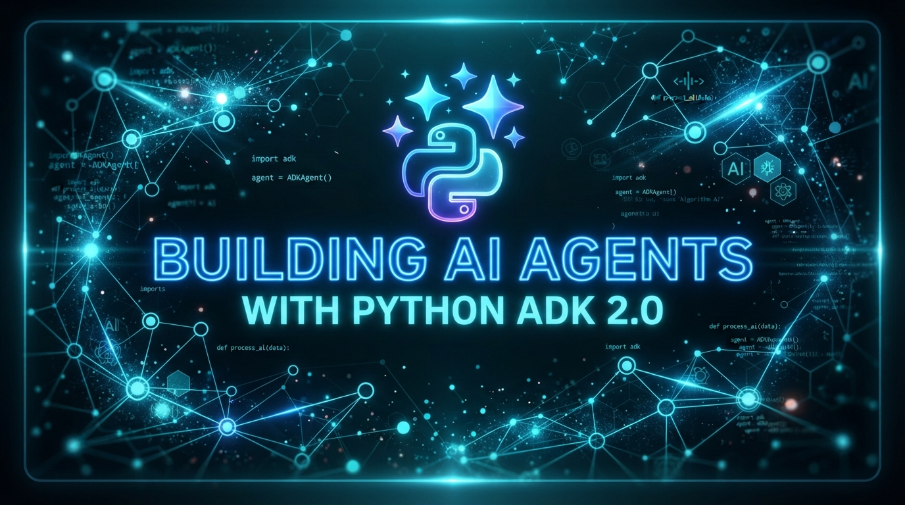

# Building AI Agents with the Python Agent Development Kit (ADK) — 2026 Edition (v2)



**Published:** 2026-07-26  
**Python ADK Version:** `google-adk>=2.0.0` (ADK 2.x)  
**Google GenAI / AI Platform SDK Version:** `google-cloud-aiplatform`  
**Python Version:** Python `3.10+` (tested on `3.13`)  

---

## Summary of 2026 Updates (v2 — Python ADK 2.0 Migration)

This updated edition incorporates several key architectural improvements, production hardening, and dependency upgrades over the initial release:

- **Python ADK 2.0 Core Upgrade**: Upgraded to **`google-adk>=2.0.0`** (`google.adk`, GA released at [adk.dev/2.0/](https://adk.dev/2.0/)), introducing `google.adk.Context` for unified tool context management, session state isolation, and callback execution pipelines.
- **Google Cloud AI Platform Integration**: Native authentication auto-detection for Vertex AI (`GOOGLE_GENAI_USE_VERTEXAI=TRUE`) and Google AI Studio Gemini API Key fallback.
- **Python Toolchain & Environment**: Modern Python runtime support (`3.10+` up to `3.13`) with structured dependency management via `requirements.txt`.
- **Code & Declarative Agent Support**: Native support for Python code-defined agents (`agent.py` exposing `root_agent`) as well as YAML-configured agents (`root_agent.yaml`).
- **Unified Execution Context**: Tools accept `tool_context: Optional[Context] = None` to inspect session metadata, user identity, and execution state.
- **Unified CLI Tooling**: Full compatibility with standard ADK 2.x CLI commands (`adk run`, `adk web`, `adk api_server`, `adk deploy cloud_run`).
- **Web UI & Remote VM Server**: Built-in developer Web UI support for both local development (`adk web`) and remote cloud instances (`adk web --host=0.0.0.0`).
- **FastAPI API Server Mode**: Server mode via `adk api_server` for embedding agent endpoints into microservice architectures.
- **Serverless Cloud Run Deployment**: Streamlined Cloud Run deployment via `adk deploy cloud_run` featuring embedded Web UI options (`--with_ui`).

---

## Key Migration Changes from ADK 1.x to ADK 2.x (Python)

If you are migrating an existing codebase from **ADK 1.x** to **ADK 2.x**, several key API shifts and architectural additions have been introduced:

| Feature / Concept | ADK 1.x (Legacy) | ADK 2.x (2026 Edition) |
|---|---|---|
| **Package / Namespace** | `adk` / legacy SDK modules | `google-adk>=2.0.0` (`google.adk`) |
| **Tool Execution Context** | Custom kwargs or implicit globals | Standard `tool_context: Optional[Context] = None` |
| **Agent Paradigm** | Code-only Python classes | Dual Code (`agent.py`) + Declarative YAML (`root_agent.yaml`) |
| **Workflows & Graphs** | Custom script loops | Native DAG execution via `google.adk.Workflow` |
| **CLI Tooling** | Fragmented script execution | Unified `adk` CLI (`run`, `web`, `api_server`, `deploy`) |
| **Session Persistence** | Synchronous, in-memory | Async persistence (`memory://`, `sqlite://`, `asyncpg`) |
| **Retries & HITL** | Manual exception catching | Framework-managed `RetryConfig` & HITL pause/resume |
| **Authentication** | Manual client configuration | Auto-detected Vertex AI (`GOOGLE_GENAI_USE_VERTEXAI`) / Gemini API key |

### Detailed Breakdown of 1.x -> 2.x Changes:

#### 1. Import Namespace Standardization
In ADK 1.x, imports relied on legacy modules or top-level `adk`. In ADK 2.x, all official components reside cleanly under the `google.adk` namespace:
```python
# ADK 1.x (Legacy)
# from adk.agents import Agent

# ADK 2.x (Current)
from google.adk import Context
from google.adk.agents import Agent
```

#### 2. Unified Tool Execution Context (`Context`)
In ADK 1.x, tools received only LLM-extracted function arguments, making session isolation or state modification awkward. In ADK 2.x, tools accept an optional `tool_context: Optional[Context] = None` parameter:
```python
# ADK 2.x Tool Signature
def my_tool(param1: str, tool_context: Optional[Context] = None) -> Dict[str, Any]:
    # Access session state, execution metadata, or user identity
    if tool_context and tool_context.state:
        session_id = tool_context.state.get("session_id")
    ...
```

#### 3. Graph & Workflow Support (`Workflow`)
ADK 2.x introduces native `Workflow` graph definitions alongside standard agents. Developers can construct directed acyclic graphs (DAGs) for multi-step agent pipelines, parallel execution paths, and state transformation nodes.

#### 4. Declarative YAML Agent Specifications
ADK 2.x adds zero-code declarative YAML definitions (`root_agent.yaml`) for prompt engineers and system configurators, supported side-by-side with programmatic Python agents (`agent.py`).

#### 5. Unified `adk` CLI Tooling
ADK 1.x relied on custom scripts or module execution commands. ADK 2.x introduces a unified `adk` binary supporting standardized operations:
- `adk run <agent_path>`: Terminal execution mode
- `adk web`: Local graphical chat UI on port 8000
- `adk web --host=0.0.0.0`: Cloud VM / Remote binding mode
- `adk api_server <agent_path>`: FastAPI microservice server mode
- `adk deploy cloud_run`: Production Cloud Run container deployment

#### 6. Asynchronous Session Providers
ADK 2.x features async session adapters supporting persistent backend drivers such as SQLite (`sqlite://`), PostgreSQL (`asyncpg`), and in-memory stores (`memory://`).

#### 7. Framework-Managed Retries & Human-in-the-Loop (HITL)
ADK 2.x provides automatic exception-aware retries via `RetryConfig` and first-class pause/resume mechanisms for Human-in-the-Loop tool authorization flows.

---

## Native Python Agent Development with the Python ADK

This tutorial provides a comprehensive guide to building, running, and deploying native AI Agents using Python and the official **Google Agent Development Kit (ADK)** (`google-adk`).

### What Is Python ADK 2.x?

The **Python Agent Development Kit (ADK 2.0)** (`google-adk>=2.0.0`) is a code-first framework created by Google for designing, testing, and deploying intelligent AI agents powered by Gemini models.

#### Key Features:
- **Model-Agnostic & Cloud-Native**: Optimized for Gemini models on Google Cloud Vertex AI or Google AI Studio.
- **Unified Context & Tool State**: Uses `google.adk.Context` to pass unified session state, credentials, and Human-in-the-Loop (HITL) context to tools.
- **Graph & Workflow Support**: Native support for DAG execution and `Workflow` graphs in `google.adk`.
- **Flexible Declarative & Code Paradigms**: Define agents programmatically in Python (`agent.py`) or declaratively via YAML (`root_agent.yaml`).
- **Built-in Developer CLI & Web UI**: Interactive debugging, web chat interface, and API server out of the box.

Official Repositories & Docs:
- ADK Documentation & GA Portal: [https://adk.dev/2.0/](https://adk.dev/2.0/)
- ADK Python 1.x to 2.x Migration Guide: [https://adk.dev/2.0/#adk-python-1x-compatibility](https://adk.dev/2.0/#adk-python-1x-compatibility)
- ADK Python GitHub Repository: [https://github.com/google/adk-python](https://github.com/google/adk-python)

---

## Key Dependencies & Directory Structure

### `requirements.txt`

The starter stack relies on Python 3.10+ and the latest `google-adk` release:

```text
# Dev environment
pip
autopep8

# Application dependencies
flask
google-adk>=2.0.0
google-cloud-aiplatform
```

### Project Layout

```text
adk-hello-world/
├── Makefile                                                    # Make targets for run, test, lint, web, deploy
├── README.md                                                   # Project documentation
├── GEMINI.md                                                   # Developer & agent instructions
├── requirements.txt                                            # Python dependencies
├── init.sh                                                     # Credentials initialization script
├── set_env.sh                                                  # Environment variables script
├── cli.sh / run.sh                                             # Interactive CLI runner scripts
├── Agent1_cli.sh                                               # CLI script for YAML Agent1
├── web.sh / webvm.sh                                           # Web UI launcher scripts
├── api_server.sh                                               # FastAPI server launch script
├── cloudrun.sh                                                 # Cloud Run deployment script
├── tests/
│   └── test_agent.py                                           # Unit tests for agent tools & timezone resolution
└── src/
    └── agents/
        ├── adk_hello_world/                                    # Python-defined agent
        │   ├── agent.py                                        # Agent definition & custom tools
        │   └── requirements.txt
        └── Agent1/                                             # Declarative YAML agent
            └── root_agent.yaml
```

---

## Checking the Developer Environment

Clone the repository and set up environment credentials:

```bash
git clone https://github.com/xbill9/adk-hello-world
cd adk-hello-world
```

### 1. Project & Credential Initialization

Run `init.sh` to configure your Google Cloud Project ID and Gemini API Key:

```bash
$ ./init.sh
--- Setting Google Cloud Project ID File ---
Please enter your Google Cloud project ID: my-gcp-project-id
You entered: my-gcp-project-id
Successfully saved project ID.
--- Setting Google Cloud Gemini Key File ---
Please enter your Google Cloud Gemini Key: AIzaSy...
Successfully saved Gemini Key.
--- Setup complete ---
```

### 2. Loading Shell Environment Variables

Source `set_env.sh` to load active environment configurations:

```bash
$ source ./set_env.sh
--- Setting Google Cloud Environment Variables ---
Checking gcloud authentication status...
gcloud is authenticated.
Are you using a Gemini API Key? (y/N): n
Configuring for Vertex AI...
Exported PROJECT_ID=my-gcp-project-id
Exported PROJECT_NUMBER=1056842563084
Exported SERVICE_ACCOUNT_NAME=1056842563084-compute@developer.gserviceaccount.com
Exported GOOGLE_CLOUD_PROJECT=my-gcp-project-id
Exported GOOGLE_GENAI_USE_VERTEXAI=TRUE
Exported GOOGLE_CLOUD_LOCATION=us-central1
Exported AGENT_PATH=/home/user/adk-hello-world/src/agents/adk_hello_world
--- Environment setup complete ---
```

---

## Building Python Agents with ADK 2.x

### 1. Code-Defined Agent (`agent.py`)

In ADK 2.x, Python function tools receive function arguments and an optional `tool_context: Optional[Context] = None`. ADK automatically inspects docstrings and type annotations to generate the tool's OpenAPI schema for Gemini.

Here is `src/agents/adk_hello_world/agent.py`:

```python
import datetime
from typing import Any
from zoneinfo import ZoneInfo, ZoneInfoNotFoundError

from google.adk.agents import Agent

CITY_TIMEZONE_MAP = {
    # New York region & aliases
    "new york": "America/New_York",
    "new york city": "America/New_York",
    "nyc": "America/New_York",
    "washington dc": "America/New_York",
    "boston": "America/New_York",

    # US Central & Pacific
    "chicago": "America/Chicago",
    "los angeles": "America/Los_Angeles",

    # Europe & Asia
    "london": "Europe/London",
    "paris": "Europe/Paris",
    "tokyo": "Asia/Tokyo",
    "beijing": "Asia/Shanghai",
    "sydney": "Australia/Sydney",
}


def resolve_timezone(city: str) -> str | None:
    """Helper function to resolve a city name or alias to an IANA timezone string."""
    city_clean = city.strip().replace(".", "")
    city_lower = city_clean.lower()
    if city_lower in CITY_TIMEZONE_MAP:
        return CITY_TIMEZONE_MAP[city_lower]

    try:
        ZoneInfo(city)
        return city
    except ZoneInfoNotFoundError:
        pass

    formatted_city = city_clean.title().replace(" ", "_")
    for region in ["America", "Europe", "Asia", "Australia", "Africa", "Pacific"]:
        candidate = f"{region}/{formatted_city}"
        try:
            ZoneInfo(candidate)
            return candidate
        except ZoneInfoNotFoundError:
            pass

    return None


def get_weather(city: str) -> dict[str, Any]:
    """Retrieves the current weather report for a specified city.

    Args:
        city (str): The name of the city for which to retrieve the weather report.
    Returns:
        A structured error explaining that live weather is not configured.
    """
    return {
        "status": "error",
        "error_message": (
            f"Live weather information for '{city}' is not available because "
            "this demo has no weather data provider configured."
        ),
    }


def get_current_time(city: str) -> dict[str, Any]:
    """Returns the current time in a specified city.

    Args:
        city (str): The name of the city for which to retrieve the current time.
    Returns:
        A structured time report or error message.
    """
    tz_identifier = resolve_timezone(city)

    if not tz_identifier:
        return {
            "status": "error",
            "error_message": f"Sorry, I don't have timezone information for {city}.",
        }

    tz = ZoneInfo(tz_identifier)
    now = datetime.datetime.now(tz)
    report = f'The current time in {city} is {now.strftime("%Y-%m-%d %H:%M:%S %Z%z")}'
    return {"status": "success", "report": report}


root_agent = Agent(
    name="weather_time_agent",
    model="gemini-2.5-flash",
    description=(
        "Agent to answer questions about the time and weather in a city."
    ),
    instruction=(
        "You are a helpful agent who can answer questions about the current "
        "time in supported cities. The weather tool does not have a live data "
        "provider; clearly tell users when weather data is unavailable."
    ),
    tools=[get_weather, get_current_time],
)
```

### 2. Declarative YAML Agent (`root_agent.yaml`)

ADK 2.x also supports declarative agent definitions in YAML, such as `src/agents/Agent1/root_agent.yaml`:

```yaml
name: Agent1
model: gemini-2.5-flash
agent_class: LlmAgent
instruction: You are the root agent that coordinates other agents.
sub_agents: []
tools:
  - name: google_search
```

---

## Running the ADK Agent Locally

### Option A: Interactive Terminal CLI (`cli.sh` / `run.sh`)

Launch an interactive terminal session with your code-defined agent using `cli.sh` or `make run`:

```bash
$ source ./cli.sh
/home/user/adk-hello-world/src/agents/adk_hello_world
adk run .

User -> What time is it in Tokyo?

Agent -> The current time in Tokyo is 2026-07-27 04:12:48 JST+0900.

User -> What is the weather in New York?

Agent -> Live weather information for 'New York' is not available because this demo has no weather data provider configured.
```

To run the YAML-configured agent `Agent1`:

```bash
$ source ./Agent1_cli.sh
/home/user/adk-hello-world/src/agents/Agent1
adk run .
```

---

### Option B: Local Web UI (`web.sh` / `webvm.sh`)

Launch the built-in visual web interface:

```bash
$ source ./web.sh
/home/user/adk-hello-world/src/agents
adk web
```

Open `http://localhost:8000` in your browser to access the graphical chat UI, inspect tool call payloads, and view real-time agent execution traces.

For remote Cloud VMs or headless setups, use `webvm.sh` to bind to all network interfaces:

```bash
$ source ./webvm.sh
Running ADK from Cloud VM
/home/user/adk-hello-world/src/agents
adk web --host=0.0.0.0
```

---

### Option C: FastAPI API Server (`api_server.sh`)

Start an API server endpoint to expose your agent over HTTP:

```bash
$ source ./api_server.sh
setting API Server Mode
/home/user/adk-hello-world/src/agents/adk_hello_world
adk api_server .
```

---

## Google Cloud Run Deployment (`cloudrun.sh`)

Deploy your Python ADK agent directly to Google Cloud Run in a single command using `cloudrun.sh`:

```bash
$ source ./cloudrun.sh
adk deploy cloud_run \
  --project=my-gcp-project-id \
  --region=us-central1 \
  --service_name=hello-world-agent-service \
  --app_name=hello-world-agent-app \
  --with_ui \
  /home/user/adk-hello-world/src/agents/adk_hello_world
```

The CLI builds the container image and provisions a fully-managed serverless endpoint on Cloud Run equipped with the web UI enabled (`--with_ui`).

---

## Summary & Next Steps

In this updated 2026 edition:
1. Migrated agent definitions to **Python ADK 2.x (`google-adk>=2.0.0`)** running on **Python 3.10+**.
2. Updated custom tools to leverage **`google.adk.Context`** for unified session state and execution pipelines.
3. Highlighted key 1.x to 2.x migration changes, including import namespaces, async session stores, `Workflow` DAG execution, declarative YAML definitions, and `RetryConfig` / HITL tools.
4. Demonstrated both **code-defined agents (`agent.py`)** and **declarative YAML agents (`root_agent.yaml`)**.
5. Validated local execution across **terminal CLI (`adk run`)**, **Web UI (`adk web`)**, and **FastAPI server (`adk api_server`)**.
6. Streamlined serverless deployment to **Google Cloud Run** with `adk deploy cloud_run`.

To explore more advanced capabilities such as multi-agent orchestration, custom callback middleware, and async persistence adapters, visit the official documentation at [adk.dev/2.0/](https://adk.dev/2.0/).
